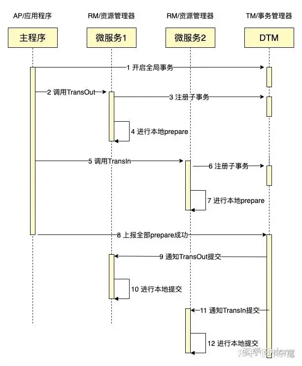
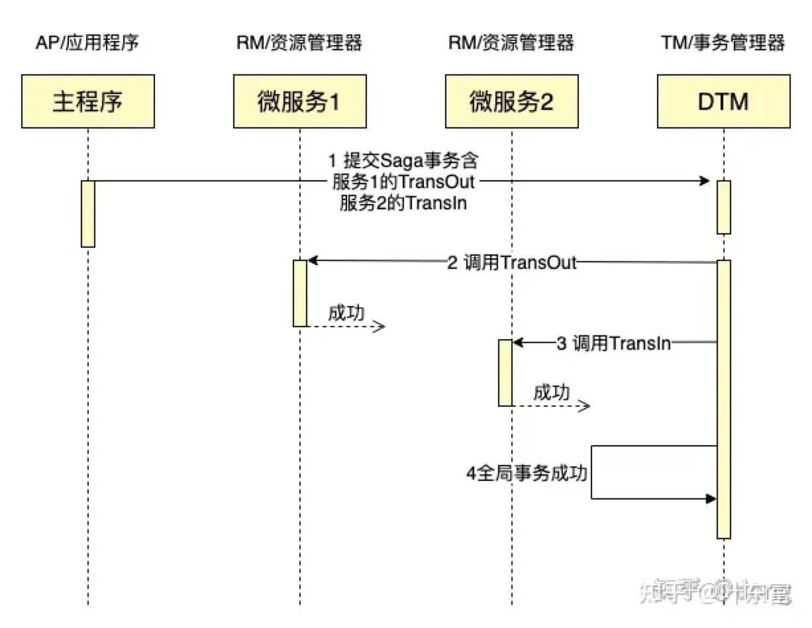
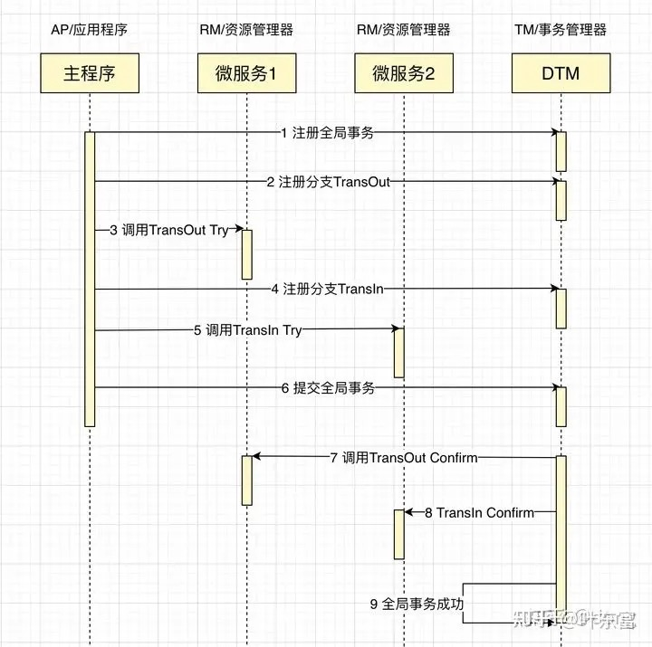

mysql如何实现可重复读
-------------

* 可重复读是指  
   一个事务执行过程中看到的数据，总是跟这个事务在启动时看到的数据是一致的。
   我们可以简单理解为：在可重复读隔离级别下，事务在启动的时候就”拍了个快照“。注意，这个快照是基于整个库的。
* InnoDB 里面每个事务都有一个唯一的事务 ID，叫作 transaction id。
  它在事务开始的时候向 InnoDB 的事务系统申请的，是按申请顺序严格递增的。
  每条记录在更新的时候都会同时记录一条 undo log，这条 log 就会记录上当前事务的 transaction id，记为 row trx_id。
  记录上的最新值，通过回滚操作，都可以得到前一个状态的值。
* 在可重复读隔离级别下，一个事务在启动时，InnoDB 会为事务构造一个数组，用来保存这个事务启动瞬间，当前正在”活跃“的所有事务ID。
  ”活跃“指的是，启动了但还没提交。
  
**小结**  
InnoDB 就是利用 undo log 和 trx_id 的配合，实现了事务启动瞬间”秒级创建快照“的能力。InnoDB 的行数据有多个版本，每个版本都有 row trx_id。
事务根据 undo log 和 trx_id 构建出满足当前隔离级别的一致性视图。可重复读的核心是一致性读，而事务更新数据的时候，只能使用当前读，如果当前记录的行锁被其他事务占用，就需要进入锁等待。

rocketMq如何实现分布式事物 -  [解读](https://www.cnblogs.com/qdhxhz/p/11191399.html)
-------------
 * A服务先发送个Half Message给Brock端，消息中携带 B服务 即将要+100元的信息。

 * 当A服务知道Half Message发送成功后，那么开始第3步执行本地事务。

 * 执行本地事务(会有三种情况1、执行成功。2、执行失败。3、网络等原因导致没有响应)

 * 本地事物结果处理
   - 如果本地事务成功，那么Product像Brock服务器发送Commit,这样B服务就可以消费该message。

   - 如果本地事务失败，那么Product像Brock服务器发送Rollback,那么就会直接删除上面这条半消息。

   - 如果因为网络等原因迟迟没有返回失败还是成功，那么会执行RocketMQ的回调接口,来进行事务的回查。

如何实现分布式事物 - [解读](https://segmentfault.com/a/1190000040321750)
-------------
>我们拿转账作为例子，A需要转100元给B，那么需要给A的余额-100元，给B的余额+100元，整个转账要保证
>，A-100和B+100同时成功，或者同时失败。看看在各种场景下，是如何解决这个问题的。

分布式事务  
银行跨行转账业务是一个典型分布式事务场景，假设A需要跨行转账给B，那么就涉及两个银行的数据，无法通过一个数据库的本地事务保证转账的ACID，只能够通过分布式事务来解决。

分布式事务就是指事务的发起者、资源及资源管理器和事务协调者分别位于分布式系统的不同节点之上。在上述转账的业务中，用户A-100操作和用户B+100操作不是位于同一个节点上。本质上来说，分布式事务就是为了保证在分布式场景下，数据操作的正确执行。

### 两阶段提交/XA  
XA是由X/Open组织提出的分布式事务的规范，XA规范主要定义了(全局)事务管理器(TM)和(局部)资源管理器(RM)之间的接口。本地的数据库如mysql在XA中扮演的是RM角色

##### XA一共分为两阶段：
* 第一阶段(prepare)：即所有的参与者RM准备执行事务并锁住需要的资源。参与者ready时，向TM报告已准备就绪
* 第二阶段 (commit/rollback)：当事务管理者(TM)确认所有参与者(RM)都ready后，向所有参与者发送commit命令。

XA 事务由一个或多个资源管理器（RM）、一个事务管理器（TM）和一个应用程序（ApplicationProgram）组成。

> 这里的RM、TM、AP三个角色是经典的角色划分，会贯穿后续Saga、Tcc等事务模式。

把上面的转账作为例子，一个成功完成的XA事务时序图如下：

如果有任何一个参与者prepare失败，那么TM会通知所有完成prepare的参与者进行回滚。

XA事务的特点是：
 * 简单易理解，开发较容易
 * 对资源进行了长时间的锁定，并发度低
 
### SAGA
Saga是这一篇数据库论文sagas提到的一个方案。其核心思想是将长事务拆分为多个本地短事务，由Saga事务协调器协调，如果正常结束那就正常完成，如果某个步骤失败，则根据相反顺序一次调用补偿操作。

把上面的转账作为例子，一个成功完成的SAGA事务时序图如下：

Saga一旦到了Cancel阶段，那么Cancel在业务逻辑上是不允许失败了。如果因为网络或者其他临时故障，导致没有返回成功，那么TM会不断重试，直到Cancel返回成功。

Saga事务的特点：
* 并发度高，不用像XA事务那样长期锁定资源
* 需要定义正常操作以及补偿操作，开发量比XA大
* 一致性较弱，对于转账，可能发生A用户已扣款，最后转账又失败的情况

论文里面的SAGA内容较多，包括两种恢复策略，包括分支事务并发执行，我们这里的讨论，仅包括最简单的SAGA
SAGA适用的场景较多，长事务适用，对中间结果不敏感的业务场景适用

### TCC

关于 TCC（Try-Confirm-Cancel）的概念，最早是由 Pat Helland 于 2007 年发表的一篇名为《Life beyond Distributed Transactions:an Apostate’s Opinion》的论文提出。  

TCC分为3个阶段
* Try 阶段：尝试执行，完成所有业务检查（一致性）, 预留必须业务资源（准隔离性）
* Confirm 阶段：确认执行真正执行业务，不作任何业务检查，只使用 Try 阶段预留的业务资源，Confirm 操作要求具备幂等设计，Confirm 失败后需要进行重试
* Cancel 阶段：取消执行，释放 Try 阶段预留的业务资源。Cancel 阶段的异常和 Confirm 阶段异常处理方案基本上一致，要求满足幂等设计。

把上面的转账作为例子，通常会在Try里面冻结金额，但不扣款，Confirm里面扣款，Cancel里面解冻金额，一个成功完成的TCC事务时序图如下：

TCC的Confirm/Cancel阶段在业务逻辑上是不允许返回失败的，如果因为网络或者其他临时故障，导致不能返回成功，TM会不断的重试，直到Confirm/Cancel返回成功。  

TCC特点如下：
 * 并发度较高，无长期资源锁定。
 * 开发量较大，需要提供Try/Confirm/Cancel接口。
 * 一致性较好，不会发生SAGA已扣款最后又转账失败的情况
 * TCC适用于订单类业务，对中间状态有约束的业务
