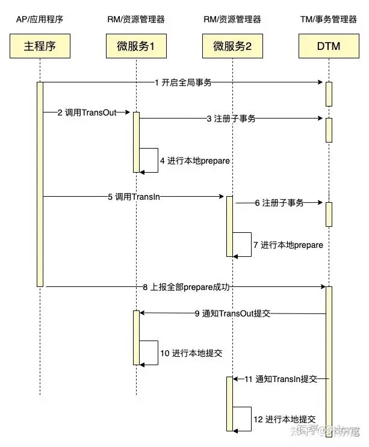

mysql如何实现可重复读
-------------

* 可重复读是指  
   一个事务执行过程中看到的数据，总是跟这个事务在启动时看到的数据是一致的。
   我们可以简单理解为：在可重复读隔离级别下，事务在启动的时候就”拍了个快照“。注意，这个快照是基于整个库的。
* InnoDB 里面每个事务都有一个唯一的事务 ID，叫作 transaction id。
  它在事务开始的时候向 InnoDB 的事务系统申请的，是按申请顺序严格递增的。
  每条记录在更新的时候都会同时记录一条 undo log，这条 log 就会记录上当前事务的 transaction id，记为 row trx_id。
  记录上的最新值，通过回滚操作，都可以得到前一个状态的值。
* 在可重复读隔离级别下，一个事务在启动时，InnoDB 会为事务构造一个数组，用来保存这个事务启动瞬间，当前正在”活跃“的所有事务ID。
  ”活跃“指的是，启动了但还没提交。
  
**小结**  
InnoDB 就是利用 undo log 和 trx_id 的配合，实现了事务启动瞬间”秒级创建快照“的能力。InnoDB 的行数据有多个版本，每个版本都有 row trx_id。
事务根据 undo log 和 trx_id 构建出满足当前隔离级别的一致性视图。可重复读的核心是一致性读，而事务更新数据的时候，只能使用当前读，如果当前记录的行锁被其他事务占用，就需要进入锁等待。

rocketMq如何实现分布式事物 -  [解读](https://www.cnblogs.com/qdhxhz/p/11191399.html)
-------------
 * A服务先发送个Half Message给Brock端，消息中携带 B服务 即将要+100元的信息。

 * 当A服务知道Half Message发送成功后，那么开始第3步执行本地事务。

 * 执行本地事务(会有三种情况1、执行成功。2、执行失败。3、网络等原因导致没有响应)

 * 本地事物结果处理
   - 如果本地事务成功，那么Product像Brock服务器发送Commit,这样B服务就可以消费该message。

   - 如果本地事务失败，那么Product像Brock服务器发送Rollback,那么就会直接删除上面这条半消息。

   - 如果因为网络等原因迟迟没有返回失败还是成功，那么会执行RocketMQ的回调接口,来进行事务的回查。

如何实现分布式事物 - [解读](https://segmentfault.com/a/1190000040321750)
-------------
##### 两阶段提交/XA  
XA是由X/Open组织提出的分布式事务的规范，XA规范主要定义了(全局)事务管理器(TM)和(局部)资源管理器(RM)之间的接口。本地的数据库如mysql在XA中扮演的是RM角色

##### XA一共分为两阶段：
* 第一阶段(prepare)：即所有的参与者RM准备执行事务并锁住需要的资源。参与者ready时，向TM报告已准备就绪
* 第二阶段 (commit/rollback)：当事务管理者(TM)确认所有参与者(RM)都ready后，向所有参与者发送commit命令。

XA 事务由一个或多个资源管理器（RM）、一个事务管理器（TM）和一个应用程序（ApplicationProgram）组成。

> 这里的RM、TM、AP三个角色是经典的角色划分，会贯穿后续Saga、Tcc等事务模式。

