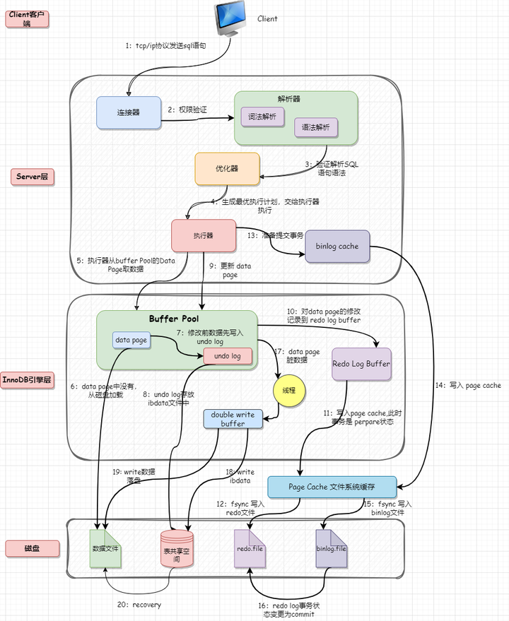

如何获取一个对象(包含两个属性)运行期间的占用内存的大小
------
* Instrumentation
使用java.lang.instrument 的Instrumentation来获取一个对象的内存大小。利用Instrumentation并且通过代理我们可以监测在JVM运行的程序的功能，
它的原理是修改方法的字节码。

自己实现一个springboot的stater
------
@ConfigurationProperties(prefix = "sms")
@Data

其他项目中使用发送短信功能的话，我们只需要在配置文件(application.ym）中配置SmsProperties 的属性信息就可以了

一条update语句的实现流程 [解读]( https://cloud.tencent.com/developer/article/2298165)
-----

HashSet的实现逻辑
-------

switch语句如何实现的（匹配字符串）
------

synchronized如何实现的
-------
synchronized的作用范围
synchronized作用于成员变量和非静态方法时，锁住的是对象的实例，即this对象
synchronized作用于静态方法时，锁住的是Class实例，因为静态方法属于Class而不属于对象。
synchronized作用于一个代码块时，锁住的是所有代码块中配置的对象

linux如何获取所有java服务的pid
------
ps -ef | grep java
ps -ef | grep java | grep -v grep | awk '{print $2}'

linux服务如何查看一个关键词的上下100行
-------
1. -C num 或者 –context=num：显示匹配行上下文的num行，默认是2行。例如，使用grep -C 2 keyword file命令可以显示匹配行及其前后2行的内容。

2. -A num 或者 –after-context=num：显示匹配行后面的num行内容。例如，使用grep -A 3 keyword file命令可以显示匹配行后面的3行内容。

3. -B num 或者 –before-context=num：显示匹配行前面的num行内容。例如，使用grep -B 4 keyword file命令可以显示匹配行前面的4行内容。

4. -m num 或者 –max-count=num：只显示匹配行的前num行。例如，使用grep -m 5 keyword file命令可以只显示匹配行的前5行内容。

综合运用这些上下文参数，可以更方便地查看关键字的上下文。例如，使用grep -C 2 keyword file命令可以显示匹配行及其前后2行的内容，帮助快速定位到关键字所在的上下文。

[覆盖索引]( https://docs.pingcode.com/ask/39637.html)
---------
在MySQL中
* 回表：当使用非聚集索引进行查询时，MySQL需要根据该索引的键值去聚集索引中查找对应的数据行的过程。
* 覆盖索引：在查询语句中，所需的数据都可以从索引中获取，而不需要再去聚集索引中查找。
* [索引下推](https://baijiahao.baidu.com/s?id=1716515482593299829&wfr=spider&for=pc)：MySQL 5.6版本引入的一项优化技术。它允许在非聚集索引中进行更多的过滤操作，减少回表次数。
  * 如果查询语句既需要获取姓名字段的值，又需要获取年龄字段的值，并且同时有姓名和年龄的索引，
  * 那么MySQL可以在姓名索引层级先过滤出符合姓名条件的记录，然后再根据年龄条件去聚集索引中查找对应的数据行。
  这样就减少了回表的次数，提高了查询性能。

spring循环依赖如何解决
------
Spring 循环依赖问题通常发生在Spring容器在创建Bean实例时，两个或多个Bean相互依赖对方，形成了一个闭环。Spring提供了多种策略来解决循环依赖问题，其中最常用的是基于代理的循环依赖解决策略。

Spring使用三级缓存来解决循环依赖问题：

singletonsCurrentlyInCreation：存储当前正在创建的Bean名称，用于检测循环依赖。

earlySingletonObjects：存储提前暴露的单例对象，也就是还没有完全创建完成的Bean对象，可以被用来解决循环依赖。

singletonFactories：存储Bean的工厂方法，用于创建Bean实例。

解决循环依赖的步骤：

启动Bean的创建过程。

在Bean的属性设置或初始化方法执行前，将Bean名称放入singletonsCurrentlyInCreation集合中。

如果在Bean的创建过程中需要注入其他Bean，首先检查singletonsCurrentlyInCreation集合，如果依赖的Bean正在创建中，则可以提前获取到一个代理对象。

如果singletonsCurrentlyInCreation集合中不存在依赖的Bean，则正常创建依赖的Bean。

依赖的Bean创建完成后，将其放入earlySingletonObjects集合中。

继续完成Bean的创建和初始化

public class A {
private B b;
    public void setB(B b) {
        this.b = b;
    }
}

public class B {
private A a;
    public void setA(A a) {
        this.a = a;
    }
}

在这个例子中，A和B互相依赖对方，Spring容器在创建A时发现需要注入B，
于是创建B，在B中发现需要注入A，此时Spring发现A正在创建中，
因此创建一个A的代理对象，并将其注入到B中，然后继续完成A的创建和初始化。这样A和B都能得到自己的完全实例，解决了循环依赖的问题。

redis过期键如何实现的
------
Redis 过期键的实现基于定时任务和惰性删除策略。

定时任务：Redis 会为每个设置了过期时间的键创建一个定时器，一旦任务过期，就会立即删除这个键。

惰性删除：当访问一个键时，Redis 会检查键是否过期，如果过期就删除它。

定期删除：Redis 默认每 100ms 随机抽查一些设置了过期时间的键，检查并清除过期键。

linux查看内存占用情况
----
top

