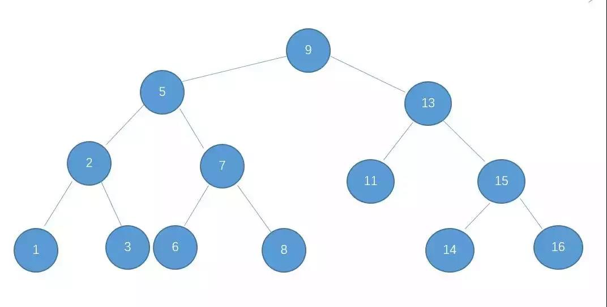
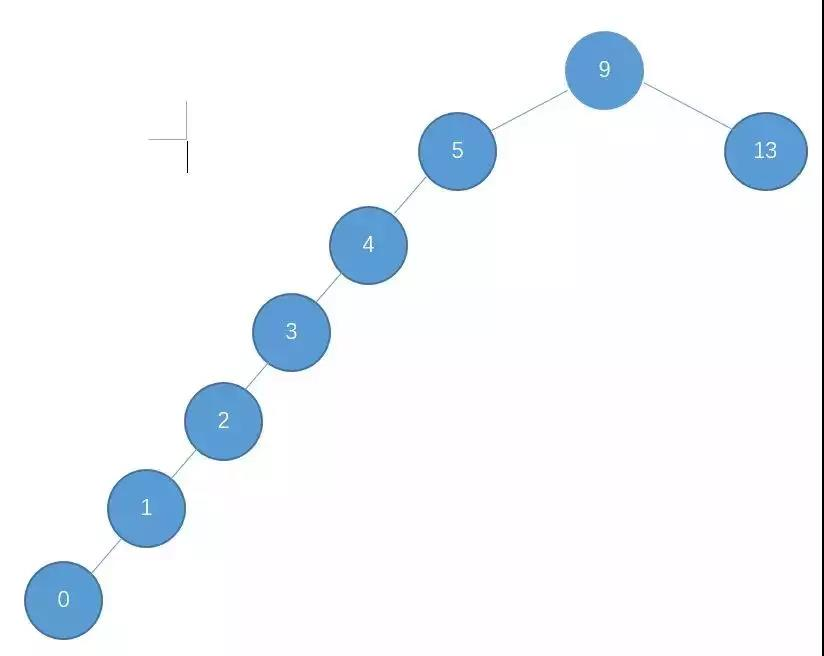
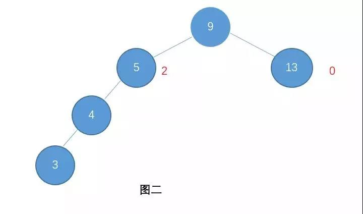
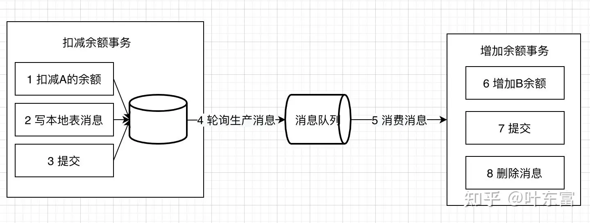
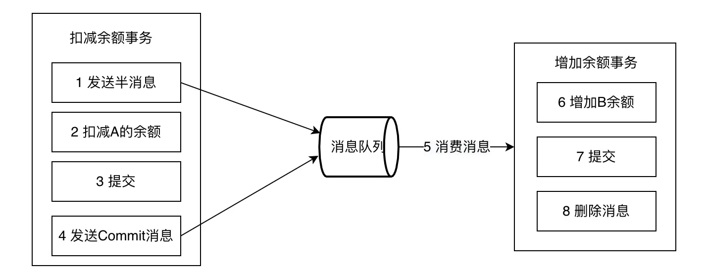

提现业务设计
-------

* 数据表设计
* 如何保证一致性，10个客户端同事请求保证不会多提现
* 2pc的流程
* 数据库如何加锁，锁升级为表锁的过程

红黑树的原理，解决了什么问题
-----

* 二叉树
    * 二叉搜索树比较简单，它是一棵二叉树，而且满足这样一个性质：对于树上的每一个节点，它左子树上的节点的值都比它小，而右子树上的节点的值都比它大。
      如下，就是一棵二叉搜索树：

      

      当我们需要往一棵二叉搜索树中插入节点时，只需要从根节点开始，依次比较，若比根节点小，则向左走，继续和左子节点比较，
      反之继续和右子节点比较，以此类推。这样的操作其实就和二分差不多，在节点值分布均匀的情况下，也就是树的结构如上所示时，
      查找的时间复杂度为O（logN），因为二叉搜索树的查询完全复杂度依赖于树的深度。所以，它有一个很大的缺陷，
      就是可能出现如下情况：

      

      我们每次插入的节点都比最小值要小，于是最终所有的节点就连成了一条链，此时深度为N，查找的时间复杂度就是O（N）了。
      为了解决这个问题，于是又有了平衡二叉树。关于二叉搜索树，可以参考这个博客：https://www.jianshu.com/p/ff4b93b088eb。
* 平衡二叉树
    * 平衡二叉树也是一棵二叉搜索树，但是它还有一个性质，就是这棵树上的每一个节点，
      其左子树和右子树的高度差都不超过一。比如图一中的二叉树，它就时一棵平衡二叉树，
      而下面这张图中的树就不是平衡二叉树，因为节点9和节点5都不平衡，它们的左右子树的高度差都是2。

      

      当发生不平衡的情况时，可以通过左旋和右旋的方式，在不改变二叉搜索树的性质的前提下，
      将树调整为平衡状态，这就是平衡二叉树。对于左旋和右旋的具体实现，我这里就不描述了，想要了解可以参考这篇博客：https://www.jianshu.com/p/655d83f9ba7b。

* 有了二叉搜索树和平衡二叉树，为什么还要红黑树？
    * 首先，二叉搜索树在极端情况下会变成一个链表，从而导致查询的时间复杂度大大提高，变成线性复杂度，
      而平衡二叉树正是为了解决这个问题才被发明出来。但是，平衡二叉树也有一定的局限。对于平衡二叉树来说，
      每个节点的子树的高度差不能超过1，一旦出现违反的情况，就需要进行左旋或者右旋操作，从而调整二叉树的高度。
      但是，在插入和删除节点的过程中，平衡度超过1是经常发生的事情，这也就导致了调整操作频繁地发生，从而提高时间复杂度。也就是说，这种追求绝对平衡的行为，并不是一个好的做法。
    * 红黑树的出现正是为了解决平衡二叉树的问题，它是平衡二叉树的变形，或者说升级。 红黑树并不追求绝对的平衡，
      它实现的是近似的平衡，这样破坏规则导致需要调整的情况就会大大减少，而且每次也只需要少量的调整即可恢复。也就是说，他在平衡和效率之间做了一个折中。
      但是统计发现，这种折中对查找的效率并没有多大的降低，这也就导致了红黑树在大多数情况下要优于平衡二叉树。而红黑树的这种折中，依靠的就是它五条性质，或者说五条约束来实现。

红黑树的五大性质
-------

* 树中的所有节点，要么是红色，要么是黑色；
* 树的根节点是黑色；
* 树中的叶子节点是黑色；（注意：这里的叶子节点不是指没有子节点的节点，而是指的空节点，比如某个节点没有左子节点，那这个不存在的左子节点其实就是这里说的叶子节点）
* 红色节点的子节点一定是黑色，也就是说没有两个连在一起的红色节点；
* 每个节点到任意一个叶子节点，经过的黑色节点数量是相等的；

> 红黑树的定理

* 红黑树从根节点到叶子节点的最长路径，不会大于最短路径的两倍
* 一棵含有n个节点的红黑树的高度至多为2log(n+1)

结论：
红黑树也是一个二叉搜索树，而二叉搜索树的查找次数取决于树的深度。此结论说明红黑树的高度至多为2log(n+1)，
也就是说红黑树的查找效率也是O（logn）级别的，和平衡二叉树近似，再加上红黑树的调整平衡的次数相对较少，所以总体来说，红黑树要优于平衡二叉树。

socket 通信原理
---
> epoll是Linux内核中实现I/O多路复用的一个机制，它允许用户空间程序同时监听多个文件描述符上的I/O事件，
> 如可读、可写等。epoll的核心数据结构包括一个红黑树和多个链表，用于存储和检索监听的事件。

epoll的底层原理可以概括为以下几个关键点：

* 网卡接收数据：当网卡检测到有数据包到达时，它会将其复制到内核缓冲区。

* 中断处理：内核中的中断处理程序会接收到网卡发送的中断信号，并根据IP头中的协议信息找到对应的socket文件。

* 进程阻塞：当socket缓冲区中有数据时，内核会唤醒被阻塞的进程，使其从等待状态变为可运行状态。

* 工作队列和等待队列：进程被唤醒后，会加入到工作队列，等待执行。同时，内核会将该socket的等待队列上的进程重新放回工作队列。

* epoll的创建和注册：epoll_create函数会创建一个epoll专用的文件描述符，并在内核中建立红黑树和链表来管理所有的文件描述符。

* epoll_ctl操作：epoll_ctl函数用于向epoll实例中注册、删除或修改文件描述符及其关联的事件。

* epoll_wait操作：epoll_wait函数用于等待事件的发生，并返回需要处理的事件的数量。

epoll的设计思路使得它相对于传统的select和poll系统调用在效率上有了显著的提升，
因为它可以同时监视多个文件描述符，并且不需要像select那样在每次调用时轮询所有监视的描述符。

总结来说，epoll通过在Linux内核中实现高效的I/O事件通知机制，
提供了一种高效的方法来处理多个文件描述符上的I/O事件，从而提高了应用程序的性能和响应速度。

HashTable原理
----

* HashMap是非同步的，没有对读写等操作进行锁保护，所以是线程不安全的，
  在多线程场景下会出现数据不一致的问题。而HashTable是同步的，所有的读写等操作都进行了锁（synchronized）保护，在多线程环境下没有安全问题。但是锁保护也是有代价的，会对读写的效率产生较大影响。
* HashMap结构中，是允许保存null的，Entry.key和Entry.value均可以为null。
  但是HashTable中是不允许保存null的。
*
HashMap的迭代器（Iterator）是fail-fast迭代器，但是Hashtable的迭代器（enumerator）不是fail-fast的。如果有其它线程对HashMap进行的添加/删除元素，将会抛出ConcurrentModificationException，但迭代器本身的remove方法移除元素则不会抛出异常。这条同样也是Enumeration和Iterator的区别。

HashMap原理
----
> * JDK1.7：Table数组+ Entry链表；
> * JDK1.8：Table数组+ Entry链表/红黑树；(为什么要使用红黑树？)

#### 重要变量介绍

* DEFAULT_INITIAL_CAPACITY Table数组的初始化长度： 1 << 4 2^4=16（为什么要是2的n次方？）
* MAXIMUM_CAPACITY Table数组的最大长度： 1<<30 2^30=1073741824
* DEFAULT_LOAD_FACTOR 负载因子：默认值为0.75。 当元素的总个数>当前数组的长度 * 负载因子。数组会进行扩容，扩容为原来的两倍（todo：为什么是两倍？）
* TREEIFY_THRESHOLD 链表树化阙值： 默认值为 8 。表示在一个node（Table）节点下的值的个数大于8时候，会将链表转换成为红黑树。
* UNTREEIFY_THRESHOLD 红黑树链化阙值： 默认值为 6 。 表示在进行扩容期间，单个Node节点下的红黑树节点的个数小于6时候，会将红黑树转化成为链表。
* MIN_TREEIFY_CAPACITY = 64 最小树化阈值，当Table所有元素超过改值，才会进行树化（为了防止前期阶段频繁扩容和树化过程冲突）。

#### put方法

* 对key的hashCode()做hash运算，计算index;
* 如果没碰撞直接放到bucket⾥；
* 如果碰撞了，以链表的形式存在buckets后；
* 如果碰撞导致链表过⻓(⼤于等于TREEIFY_THRESHOLD)，就把链表转换成红⿊树(JDK1.8中的改动)；
* 如果节点已经存在就替换old value(保证key的唯⼀性)
* 如果bucket满了(超过load factor*current capacity)，就要resize

#### resize方法

HashMap 的扩容实现机制是将老table数组中所有的Entry取出来，重新对其Hashcode做Hash散列到新的Table中，可以看到注解Initializes
or doubles table size. resize表示的是对数组进行初始化或
进行Double处理。

#### get方法

* 对key的hashCode()做hash运算，计算index;
* 如果在bucket⾥的第⼀个节点⾥直接命中，则直接返回；
* 如果有冲突，则通过key.equals(k)去查找对应的Entry;
* 若为树，则在树中通过key.equals(k)查找，O(logn)；
* 若为链表，则在链表中通过key.equals(k)查找，O(n)。

在进行取值时候，因为对于我们传进来的key值进行了一系列的hash操作，首先，在传进来 key值时候，先进性hash操作，

#### 还知道哪些hash算法

Hash函数是指把⼀个⼤范围映射到⼀个⼩范围。把⼤范围映射到⼀个⼩范围的⽬的往往是为了节省空间，
使得数据容易保存。
⽐较出名的有MurmurHash、MD4、MD5等等

redis分布式锁与zk分布式锁的区别
-----

#### Redis分布式锁：

* 原理：Redis分布式锁的实现通常使用了SETNX(SET if Not eXists)命令和EXPIRE命令。
  使用SETNX可以尝试将一个键值对设置到Redis中，只有在该键不存在的情况下才能成功。
  成功获取锁的客户端可以设置一个过期时间，确保即使在发生故障的情况下，锁也能自动释放。

* 特点：Redis分布式锁的实现比较简单，易于理解和部署。它适用于短期的锁定操作，因为Redis的性能很高，并且可以支持高并发的请求。
  此外，Redis还提供了一些扩展功能，如在锁定期间检测持有锁的客户端是否存活等。

* 优点：简单易用，性能高，支持高并发。

* 缺点：Redis是一个内存数据库，如果持有锁的客户端出现故障或网络问题，
  可能会导致死锁或锁丢失的问题。另外，Redis的分布式锁在网络分区的情况下可能会出现问题。

#### ZooKeeper分布式锁：

* 原理：ZooKeeper是一个分布式协调服务，它使用znode(一种特殊的数据节点)来实现分布式锁。
  客户端可以尝试创建一个唯一的znode，并使用ZooKeeper的顺序节点功能来保持节点的顺序。
  通过比较自己创建的节点与当前最小节点的顺序，客户端可以判断是否获取到了锁。当客户端释放锁时，它会删除对应的znode。

* 特点：ZooKeeper提供了强一致性和顺序性的保证，适用于需要严格顺序访问的场景。
  它的分布式锁实现相对复杂一些，但提供了更多的功能和保证，比如阻塞等待、超时处理、重入锁等。

* 优点：强一致性和顺序性保证，可靠性较高，支持复杂的锁定需求。

* 缺点：相对于Redis，ZooKeeper的部署和维护复杂一些。此外，ZooKeeper的性能相对较低，
  适用于对性能要求不高的场景。

#### 适用场景：

* Redis分布式锁适用于对性能要求较高的场景，例如短期的锁定操作、高并发请求和对并发性能有较高要求的情况。
  由于Redis的简单性和高性能，它在大多数场景下都是一个不错的选择。但需要注意的是，由于Redis是内存数据库，如果持有锁的客户端发生故障或网络问题，可能会导致锁丢失或死锁的问题。

* ZooKeeper 分布式锁适用于对可靠性和顺序性要求较高的场景。它提供了强一致性和顺序性的保证，
  适用于需要严格的锁顺序访问的场景。ZooKeeper的分布式锁实现相对复杂一些，但提供了更多的功能和保证，如阻塞等待、超时处理、重入锁等。如果你的应用程序需要这些高级功能，ZooKeeper是一个较好的选择。但需要注意的是，ZooKeeper的部署和维护相对复杂，并且性能较低，因此在对性能要求较高的场景下可能不太适合使用。

#### 总结来说：

* Redis分布式锁：简单易用、性能高、适用于对性能要求较高的场景，但可能存在锁丢失或死锁的问题。

* ZooKeeper分布式锁：强一致性和顺序性保证、可靠性高、适用于对可靠性和顺序性要求较高的场景，
  但部署和维护较复杂，性能较低。

分布式事务有哪些  - [解读](https://segmentfault.com/a/1190000040321750)
--------

#### 一、两阶段提交/XA

> XA是由X/Open组织提出的分布式事务的规范，XA规范主要定义了(全局)事务管理器(TM)和(局部)资源管理器(RM)之间的接口。
> 本地的数据库如mysql在XA中扮演的是RM角色

XA一共分为两阶段：

* 第一阶段（prepare）：即所有的参与者RM准备执行事务并锁住需要的资源。参与者ready时，向TM报告已准备就绪。
* 第二阶段 (commit/rollback)：当事务管理者(TM)确认所有参与者(RM)都ready后，向所有参与者发送commit命令。
  目前主流的数据库基本都支持XA事务，包括mysql、oracle、sqlserver、postgre

XA事务由一个或多个资源管理器（RM）、一个事务管理器（TM）和一个应用程序（ApplicationProgram）组成。

> 这里的RM、TM、AP三个角色是经典的角色划分，会贯穿后续Saga、Tcc等事务模式。

如果有任何一个参与者prepare失败，那么TM会通知所有完成prepare的参与者进行回滚。

XA事务的特点是：

* 简单易理解，开发较容易
* 对资源进行了长时间的锁定，并发度低

#### 二、SAGA
>Saga是这一篇数据库论文sagas提到的一个方案。其核心思想是将长事务拆分为多个本地短事务，由Saga事务协调器协调，如果正常结束那就正常完成，
如果某个步骤失败，则根据相反顺序一次调用补偿操作。

Saga事务的特点：
* 并发度高，不用像XA事务那样长期锁定资源
* 需要定义正常操作以及补偿操作，开发量比XA大
* 一致性较弱，对于转账，可能发生A用户已扣款，最后转账又失败的情况
* SAGA适用的场景较多，长事务适用，对中间结果不敏感的业务场景适用

#### 三、TCC
TCC分为3个阶段
* Try 阶段：尝试执行，完成所有业务检查（一致性）, 预留必须业务资源（准隔离性）
* Confirm 阶段：确认执行真正执行业务，不作任何业务检查，只使用 Try 阶段预留的业务资源，Confirm 操作要求具备幂等设计，Confirm 失败后需要进行重试。
* Cancel 阶段：取消执行，释放 Try 阶段预留的业务资源。Cancel 阶段的异常和 Confirm 阶段异常处理方案基本上一致，要求满足幂等设计。

> TCC的Confirm/Cancel阶段在业务逻辑上是不允许返回失败的，如果因为网络或者其他临时故障，导致不能返回成功，TM会不断的重试，
> 直到Confirm/Cancel返回成功。

TCC特点如下：
* 并发度较高，无长期资源锁定。
* 开发量较大，需要提供Try/Confirm/Cancel接口。
* 一致性较好，不会发生SAGA已扣款最后又转账失败的情况
* TCC适用于订单类业务，对中间状态有约束的业务

#### 四、本地消息表

大致流程如下：
 
写本地消息和业务操作放在一个事务里，保证了业务和发消息的原子性，要么他们全都成功，要么全都失败。

容错机制：
* 扣减余额事务 失败时，事务直接回滚，无后续步骤
* 轮序生产消息失败， 增加余额事务失败都会进行重试

本地消息表的特点：
* 不支持回滚
* 轮询生产消息难实现，如果定时轮询会延长事务总时长，如果订阅binlog则开发维护困难

适用于可异步执行的业务，且后续操作无需回滚的业务

#### 五、事务消息
在上述的本地消息表方案中，生产者需要额外创建消息表，还需要对本地消息表进行轮询，业务负担较重。阿里开源的RocketMQ 4.3之后的版本正式支持事务消息，
该事务消息本质上是把本地消息表放到RocketMQ上，解决生产端的消息发送与本地事务执行的原子性问题。

事务消息发送及提交：
* 发送消息（half消息）
* 服务端存储消息，并响应消息的写入结果
* 根据发送结果执行本地事务（如果写入失败，此时half消息对业务不可见，本地逻辑不执行）
* 根据本地事务状态执行Commit或者Rollback（Commit操作发布消息，消息对消费者可见）

正常发送的流程图如下：

补偿流程：
对没有Commit/Rollback的事务消息（pending状态的消息），从服务端发起一次“回查”
Producer收到回查消息，返回消息对应的本地事务的状态，为Commit或者Rollback
事务消息方案与本地消息表机制非常类似，区别主要在于原先相关的本地表操作替换成了一个反查接口

事务消息特点如下：
* 长事务仅需要分拆成多个任务，并提供一个反查接口，使用简单
* 事务消息的回查没有好的方案，极端情况可能出现数据错误

适用于可异步执行的业务，且后续操作无需回滚的业务

#### 六、最大努力通知
发起通知方通过一定的机制最大努力将业务处理结果通知到接收方。具体包括：

有一定的消息重复通知机制。因为接收通知方可能没有接收到通知，此时要有一定的机制对消息重复通知。
消息校对机制。如果尽最大努力也没有通知到接收方，或者接收方消费消息后要再次消费，此时可由接收方主动向通知方查询消息信息来满足需求。
前面介绍的的本地消息表和事务消息都属于可靠消息，与这里介绍的最大努力通知有什么不同？

可靠消息一致性，发起通知方需要保证将消息发出去，并且将消息发到接收通知方，消息的可靠性关键由发起通知方来保证。

最大努力通知，发起通知方尽最大的努力将业务处理结果通知为接收通知方，但是可能消息接收不到，此时需要接收通知方主动调用发起通知方的接口查询业务处理结果，通知的可靠性关键在接收通知方。

解决方案上，最大努力通知需要：
* 提供接口，让接受通知放能够通过接口查询业务处理结果
* 消息队列ACK机制，消息队列按照间隔1min、5min、10min、30min、1h、2h、5h、10h的方式，逐步拉大通知间隔 ，直到达到通知要求的时间窗口上限。之后不再通知

最大努力通知适用于业务通知类型，例如微信交易的结果，就是通过最大努力通知方式通知各个商户，既有回调通知，也有交易查询接口

#### 七、AT事务模式
这是阿里开源项目seata中的一种事务模式，在蚂蚁金服也被称为FMT。优点是该事务模式使用方式，类似XA模式，业务无需编写各类补偿操作，回滚由框架自动完成，该模式缺点也较多，一方面类似XA，存在较长时间的锁，不满足高并发的场景；
另一方面存在脏回滚之类的问题，容易引发数据不一致。

分库分表
------
* 什么时候分库?
  * 分库主要解决的是并发量大的问题。因为并发量一旦上来了，那么数据库就可能会成为瓶颈，因为数据库的连接数是有限的，虽然可以调整，但是也不是无限调整的。
    当你的数据库的读或者写的QPS过高，导致你的数据库连接数不足了的时候，就需要考虑分库了，通过增加数据库实例的方式来提供更多的可用数据库链接，从而提升系统的并发度。
* 什么时候分表?
  * 那分表其实主要解决的是数据量大的问题。
    假如你的单表数据量非常大，因为并发不高，数据量连接可能还够，但是存储和查询的性能遇到了瓶颈了，
    你做了很多优化之后还是无法提升效率的时候，就需要考虑做分表了。

如何避免缓存穿透，缓存雪崩
--------

本地缓存如何修改
-------

redis的map如何实现的
-----

