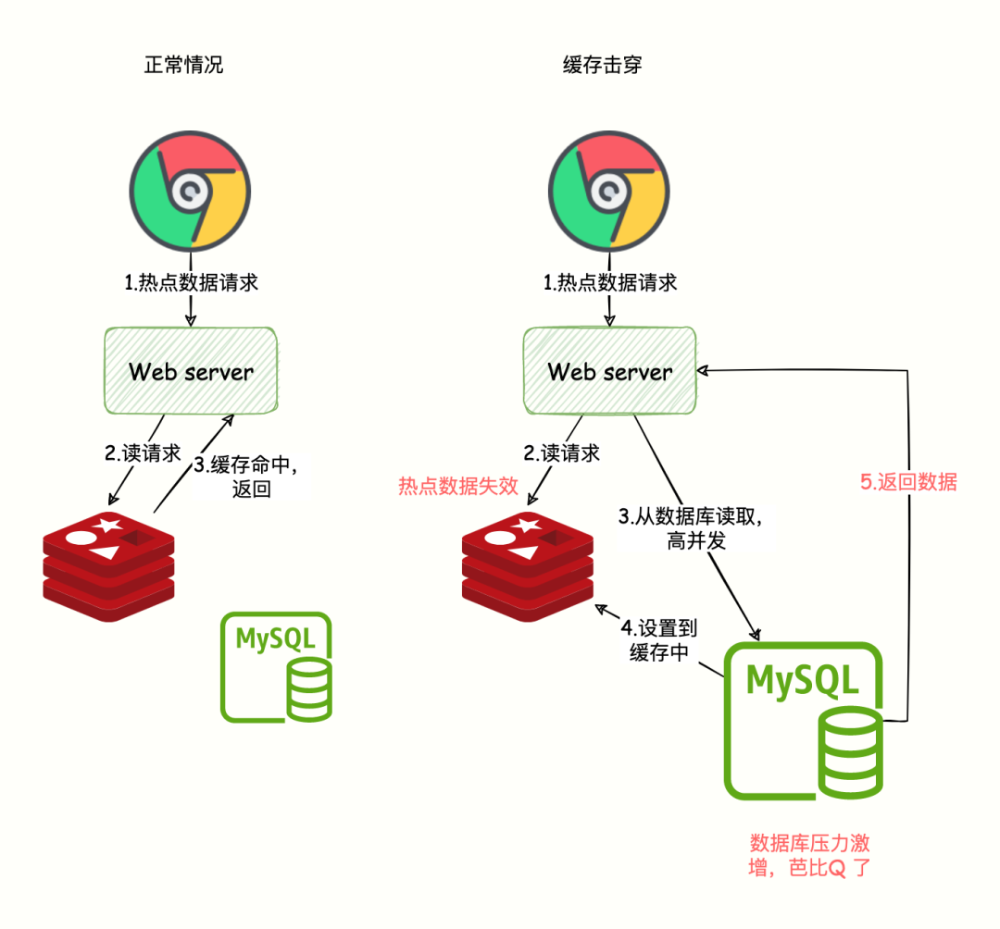
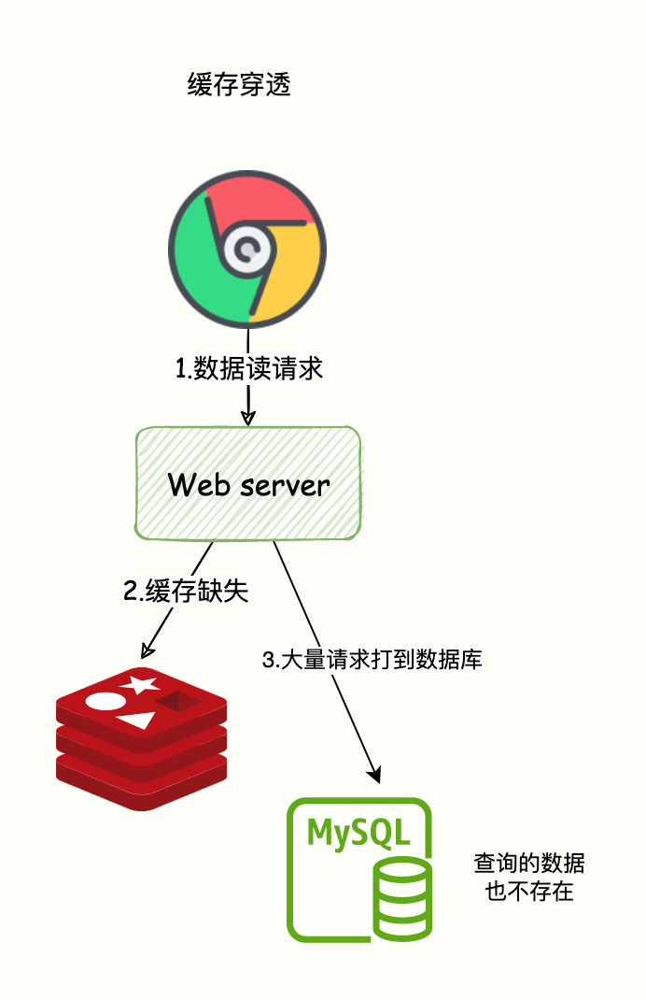
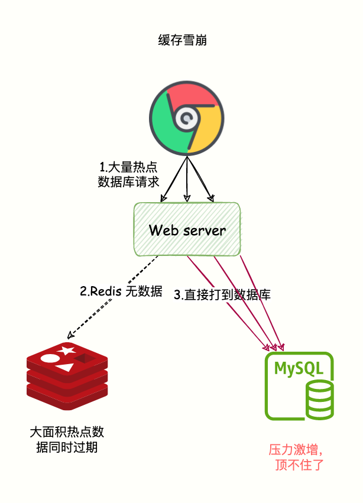

一、如何设计数据库的主键
=====
二、实际业务中如何做的分库分表
====
三、如何加索引
=====
   数据库字段：省、市、时间...等其他字段
   问题：获取时间下的数据
   时间范围查询索引失效怎么办

四、基于业务设计一个redis分布式锁
===
redis分布式锁value如何设计
watchdog如何实现的

五、三个线程同时竞争分布式锁的过程
====

六、如何使用redis的存热点数据，如何避免缓存击穿
===
1、缓存击穿(失效)
>> 缓存击穿（失效）指的是数据库有数据，缓存本应该也有数据，但是缓存过期了，Redis 这层流量防护屏障被击穿了，请求直奔数据库。

**解决方案**
* 过期时间 + 随机值
  设计缓存的过期时间时，使用公式：过期时间=baes 时间+随机时间。
即相同业务数据写缓存时，在基础过期时间之上，再加一个随机的过期时间，让数据在未来一段时间内慢慢过期，避免瞬时全部过期，对 DB 造成过大压力。
* 预热
  预先把热门数据提前存入 Redis 中，并设热门数据的过期时间超大值。
* 当发现缓存失效的时候，不是立即从数据库加载数据。
  而是先获取分布式锁，获取锁成功才执行数据库查询和写数据到缓存的操作，获取锁失败，
  则说明当前有线程在执行数据库查询操作，当前线程睡眠一段时间在重试。
  这样只让一个请求去数据库读取数据。

2、缓存穿透
>> 缓存穿透：意味着有特殊请求在查询一个不存在的数据，即数据不存在 Redis 也不存在于数据库。
导致每次请求都会穿透到数据库，缓存成了摆设，对数据库产生很大压力从而影响正常服务。

**解决方案**
* 缓存空值：当请求的数据不存在 Redis 也不存在数据库的时候，设置一个缺省值(比如：None)。当后续再次进行查询则直接返回空值或者缺省值。
* 布隆过滤器：在数据写入数据库的同时将这个 ID 同步到到布隆过滤器中，当请求的 id 不存在布隆过滤器中则说明该请求查询的数据一定没有在数据库中保存，就不要去数据库查询了。

3、缓存雪崩
>> 缓存雪崩指的是大量的请求无法在 Redis 缓存系统中处理，请求全部打到数据库，导致数据库压力激增，甚至宕机。
> 出现该原因主要有两种：
> * 大量热点数据同时过期，导致大量请求需要查询数据库并写到缓存；
> * Redis 故障宕机，缓存系统异常。

**_缓存雪崩是发生在大量数据同时失效的场景，而缓存击穿(失效)是在某个热点数据失效的场景，这是他们最大的区别。_**

**总结**
* 缓存穿透指的是数据库本就没有这个数据，请求直奔数据库，缓存系统形同虚设。
* 缓存击穿(失效)指的是数据库有数据，缓存本应该也有数据，但是缓存过期了，Redis 这层流量防护屏障被击穿了，请求直奔数据库。
* 缓存雪崩指的是大量的热点数据无法在 Redis 缓存中处理(大面积热点数据缓存失效、Redis 宕机)，流量全部打到数据库，导致数据库极大压力。

**解决方案**
* 过期时间添加随机值
* 当访问的不是核心数据的时候，在查询的方法上加上接口限流保护。比如设置 10000 req/s。 如果访问的是核心数据接口，缓存不存在允许从数据库中查询并设置到缓存中。这样的话，只有部分请求会发送到数据库，减少了压力。

七、某个接口会面临大量请求，如何设计
===
限流
异步
监控
降级

八、访问三方的接口token如何获取和存储（失效处理）
=====

九、一个list中有一万条数据，你有几种办法分成10个list
=====
* [点击前往](./WriteExam.java)

