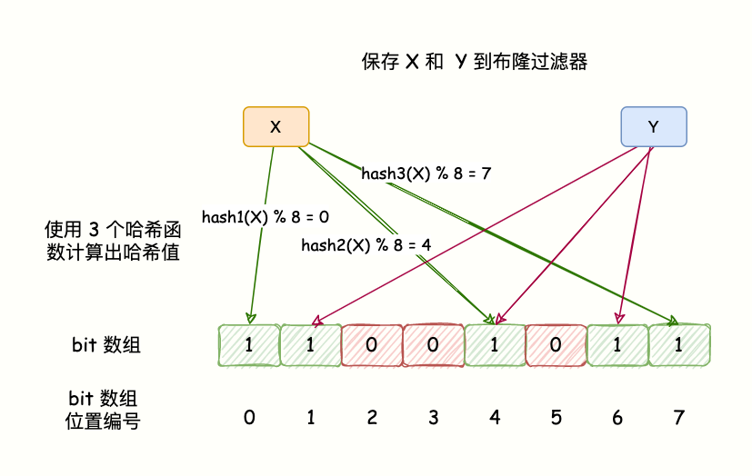

一、布隆过滤器原理
=====
>> BloomFilter 的算法是，首先分配一块内存空间做 bit 数组，数组的 bit 位初始值全部设为 0。
加入元素时，采用 k 个相互独立的 Hash 函数计算，然后将元素 Hash 映射的 K 个位置全部设置为 1。
检测 key 是否存在，仍然用这 k 个 Hash 函数计算出 k 个位置，如果位置全部为 1，则表明 key 存在，否则不存在。

**如下图所示：**

哈希函数会出现碰撞，所以布隆过滤器会存在误判。
这里的误判率是指，BloomFilter 判断某个 key 存在，但它实际不存在的概率，因为它存的是 key 的 Hash 值，而非 key 的值。
所以有概率存在这样的 key，它们内容不同，但多次 Hash 后的 Hash 值都相同。
对于 BloomFilter 判断不存在的 key ，则是 100% 不存在的，反证法，如果这个 key 存在，那它每次 Hash 后对应的 Hash 值位置肯定是 1，而不会是 0。布隆过滤器判断存在不一定真的存在。

二、限流算法
===
[点击前往](/Users/user/IdeaProjects/sun-summarize/sun-summarize-base-algorithm/src/main/java/limiting/Question.md)

