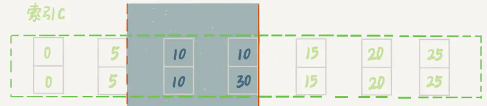

频繁full gc与频繁young gc，如何排查
=============
间隙锁在等值查询，在唯一索引和非唯一索引下，是如何使用的
=========
间隙锁（Gap Lock）是Innodb在 可重复读 提交下为了解决幻读问题时引入的锁机制，（下面的所有案例没有特意强调都使用可重复读隔离级别）
幻读的问题存在是因为新增或者更新操作，这时如果进行范围查询的时候（加锁查询），会出现不一致的问题，
这时使用不同的行锁已经没有办法满足要求，需要对一定范围内的数据进行加锁，间隙锁就是解决这类问题的。
在可重复读隔离级别下，数据库是通过行锁和间隙锁共同组成的（next-key lock），来实现的

**加锁规则有以下特性，我们会在后面的案例中逐一解释：**   

1.加锁的基本单位是（next-key lock）,他是前开后闭原则  
2.查询过程中访问的对象会增加锁   
3.索引上的等值查询--给唯一索引加锁的时候，next-key lock升级为行锁  
4.索引上的等值查询--向右遍历时最后一个值不满足查询需求时，next-key lock 退化为间隙锁   
5.唯一索引上的范围查询会访问到不满足条件的第一个值为止  

案例数据：
 
id(主键)|c（普通索引）|d（无索引）   
----|------|----  
5	|  5	|5  
10  | 10	|10  
15  | 15    |15  
20  | 20	|20  
25  | 25	|25   

以上数据为了解决幻读问题，更新的时候不只是对上述的五条数据增加行锁，
还对于中间的取值范围增加了6间隙锁，（-∞，5]（5，10]（10，15]（15，20]（20，25]（25，+supernum] （其中supernum是数据库维护的最大的值。为了保证间隙锁都是左开右闭原则。）

#### 案例一：间隙锁简单案例

   步骤 | 	事务A	| 事务B   
   ----|   ------   |  ----  
   1   |  begin;   select * from t where id = 11 for update;
   2   | 	- |   insert into user value(12,12,12);   blocked
   3   | commit; |  -
 
 当有如下事务A和事务B时，事务A会对数据库表增加（10，15]这个区间锁，
 这时insert id = 12 的数据的时候就会因为区间锁（10，15]而被锁住无法执行。
 
#### 案例二： 间隙锁死锁问题

  步骤 | 	事务A	| 事务B   
   ----|   ------   |  ----  
   1   |   begin; select * from t where id = 9 for update;| -
   2   | 	- | begin;  select * from t where id = 6 for update;	
   3   | 	- | insert into user value(7,7,7) blocked	
   4   | 	insert into user value(7,7,7) blocked | -  
   	
  不同于写锁相互之间是互斥的原则，间隙锁之间不是互斥的，如果一个事务A获取到了（5,10]之间的间隙锁，
  另一个事务B也可以获取到（5,10]之间的间隙锁。这时就可能会发生死锁问题    
  如下案例:   
  * 事务A获取到（5,10]之间的间隙锁不允许其他的DDL操作，在事务提交，间隙锁释放之前，   
  * 事务B也获取到了间隙锁（5,10]，这时两个事务就处于死锁状态

#### 案例三： 等值查询—唯一索引

   步骤 | 	事务A	| 事务B     | 事务c              
   ----|   ------   |  ---     |  ----       
   1   |   begin; update u set d= d+ 1 where id = 7;      |   -      |   -         
   2   | 	-       |   insert into u (8,8,8); blocked     |   -		 
   3   | 	-       |   -      |   update set d = d+ 1 where id = 10      	 
      
* 加锁的范围是（5,10]的范围锁
* 由于数据是等值查询，并且表中最后数据id = 10 不满足id= 7的查询要求，故id=10 的行级锁退化为间隙锁，（5,10）
* 所以事务B中id=8会被锁住，而id=10的时候不会被锁住  

#### 案例四： 等值查询—普通索引                                     
  
   步骤 | 	事务A	| 事务B     | 事务c       
   ----|   ------   |  ---     |  ----
   1   |    begin; select id form t where c = 5 lock in share mode;       |   -      |   -    
   2   | 	-       |   update t set d = d + 1 where id = 5      |   -		
   3   | 	-       |   -      |   insert into values (7,7,7) blocked	

* 加锁的范围是（0,5]，（5,10]的范围锁
* 由于c是普通索引，根据原则4，搜索到5后继续向后遍历直到搜索到10才放弃，故加锁范围为（5,10]
* 由于查询是等值查询，并且最后一个值不满足查询要求，故间隙锁退化为（5,10）
* 因为加锁是对普通索引c加锁，而且因为索引覆盖，没有对主键进行加锁，所以事务B执行正常
* 因为加锁范围（5,10）故事务C执行阻塞
* 需要注意的是，lock in share mode 因为覆盖索引故没有锁主键索引，如果使用for update 程序会觉得之后会执行更新操作故会将主键索引一同锁住

#### 案例五： 范围查询—唯一索引

   步骤 | 	事务A	| 事务B     | 事务c       
   ----|   ------   |  ---     |  ----
   1   |    begin; select * form t where id >= 10 and id <11 for update       |   -      |   -    
   2   | 	-       |  insert into values(8,8,8) insert into values(13,13,13) blocked     |   -		
   3   | 	-       |   -      |  update t set d = d+ 1 where id = 15 blocked

* next-key lock 增加范围锁（5,10]
* 根据原则5，唯一索引的范围查询会到第一个不符合的值位置，故增加（10，15]
* 因为等值查询有id =10 根据原则3间隙锁升级为行锁，故剩余锁[10,15]
* 因为查询并不是等值查询，故[10,15]不会退化成[10,15)
* 故事务B（13,13,13）阻塞，事务C阻塞

### 案例六： 范围查询—普通索引

   步骤 | 	事务A	| 事务B     | 事务c       
   ----|   ------   |  ---     |  ----
   1   |    begin; select * form t where c >= 10 and c <11 for update       |   -      |   -    
   2   | 	-       |   insert into values(8,8,8) blocked      |   -		
   3   | 	-       |   -      |  update t set d = d+ 1 where c = 15 blocked 
   
* next-key lock 增加范围锁（5,10]，（10，15]
* 因为c是非唯一索引，故（5,10]不会退化为10
* 因为查询并不是等值查询，故[10,15]不会退化成[10,15)
* 所以事务B和事务C全部堵塞

#### 案例七： 普通索引-等值问题

上面的数据增加一行（30,10,30），这样在数据库中存在的c=10的就有两条记录

id(主键)|c（普通索引）|d（无索引）   
----|------|----  
30	|  **10**	|530 

------------

   步骤 | 	事务A	| 事务B     | 事务c       
   ----|   ------   |  ---     |  ----
   1   |    begin; delete from t where c = 10       |   -      |   -    
   2   | 	-       |   insert into values(12,12,12) blocked      |   -		
   3   | 	-       |   -      |   -   
   4   | 	-       |   -      |   -   
   4   | 	-       |   -      |   update t set d = d+ 1 where c = 15 ok		

* next-key lock 增加范围锁（5,10]，（10，15]
* 因为是等值查询故退化为（5,10]，（10，15），故事务B阻塞，事务C执行成功

#### 案例八：普通索引-等值Limit问题

   步骤 | 	事务A	| 事务B     | 事务c       
   ----|   ------   |  ---     |  ----
   1   |    begin; delete from t where c = 10 limit 2       |   -      |   -    
   2   | 	-       |   insert into values(12,12,12) ok     |   -		
   3   | 	-       |   -      |   update t set d = d+ 1 where c = 15  ok   
* 根据上面案例7改造，将delete增加limit操作2的操作
* 因为知道了数据加锁值加2条，故在加锁（5，10]之后发现已经有两条数据，
  故后面不在向后匹配加锁。所以事务B执行成功  
  
 加锁范围如下   
   

    
状态设计模式与策略设计模式的区别
========

* 状态模式重点在各状态之间的切换，从而做不同的事情；而策略模式更侧重于根据具体情况选择策略，并不涉及切换。
* 状态模式不同状态下做的事情不同，而策略模式做的都是同一件事。例如，聚合支付平台，有支付宝、微信支付、银联支付，虽然策略不同，但最终做的事情都是支付，也就是说他们之间是可替换的。反观状态模式，各个状态的同一方法做的是不同的事，不能互相替换。
* 状态模式封装了对象的状态，而策略模式封装算法或策略。因为状态是跟对象密切相关的，它不能被重用；而策略模式通过从Context中分离出策略或算法，我们可以重用它们。
* 在状态模式中，每个状态通过持有Context的引用，来实现状态转移；但是每个策略都不持有Context的引用，它们只是被Context使用。
* 状态模式将各个状态所对应的操作分离开来，即对于不同的状态，由不同的子类实现具体操作，不同状态的切换由子类实现，当发现传入参数不是自己这个状态所对应的参数，则自己给Context类切换状态；这种转换是"自动"，"无意识"的。状态模式允许对象在内部状态改变时改变它的行为，对象看起来好像修改了它的类。而策略模式是直接依赖注入到Context类的参数进行策略选择，不存在切换状态的操作。
* 策略模式的客户端必须对所有的策略类相当了解，明确当前场景下各种策略的利弊，权衡在当前场景下应该使用哪种策略，也就是是说策略类对客户端是暴露的，策略是外界给的，策略怎么变，是调用者考虑的事情，系统只是根据所给的策略做事情。   

> 状态模式依赖于其状态的变化时其内部的行为发生变化，将动作委托到代表当前状态的对象，
>对外表现为类发生了变化。状态是系统自身的固有的，由系统本身控制，调用者不能直接指定或改变系统的状态转移。    

什么是内存泄漏
=====
ThreadLocal为什么会导致内存泄漏
========
volatile关键词的作用
========
本地缓存与分布式缓存的区别
========
对象从创建到销毁的过程
====
SpringBoot的启动过程
=========
灰度功能的实现
=======
jvm调优的常用参数
========
